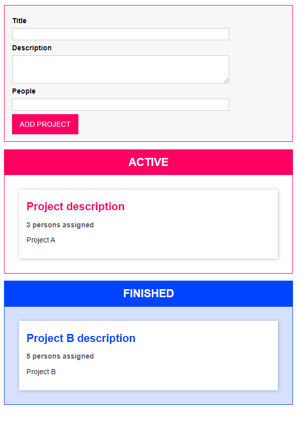

# drag-and-drop
Drag and Drop with typescript and webpack

>

## Technologies/Tools

- [Typescript](https://www.typescriptlang.org/)
- [Webpack](https://webpack.js.org/)
- [HTML Drag and Drop API](https://developer.mozilla.org/en-US/docs/Web/API/HTML_Drag_and_Drop_API)

##  Project

Project to train Typescript concepts during the course of Maximilian Schwarzmüller (https://www.udemy.com/course/understanding-typescript/)

## How to Run

1. Install the dependencies with `npm i`.
2. Run your application with `npm start`.

